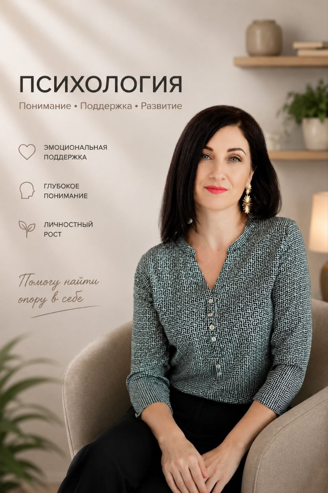

# Полная история разработки и настройки litvinova-psy.ru

---

## 1. Автоматизация и рабочие процессы (n8n & AI)
* **Настройка n8n:** Настройка автономных сценариев (workflows) и нод для автоматизации контента и рабочих процессов.
* **Использование ИИ-агентов:** Интеграция нейросетей и сборщиков (RSS) для анализа новостей, генерации текстов и автоматизации задач.

---

## 2. Разработка сайта и интеграция с PageCMS
* **Архитектура и структура:** Создание файлов сайта (`index.html`, `about.html`, `services.html`, `blog.html` и др.), генерация `sitemap.xml` и файла конфигурации `pagecms.json`.
* **Обработка графики:** Работа над визуалом (включая отделение объекта от фона и подготовку фоновых элементов под золотистые волнистые линии) для гармоничного включения в Hero-секцию.
* **SEO и мета-данные:** Настройка структуры Front Matter (переменных `meta_title`, `hero_title` и др.) для корректного отображения сайта в поисках и редакторе PageCMS.

---

## 3. Сессия от 22 июля 2026 г.: Решение проблем с версткой и фото

### Проблема 1: Ошибка «Error: missing bundle data»
* **Симптомы:** При запуске `index.html` локально открывался тёмный экран с предупреждением от скрипта бандлера.
* **Причина:** Отсутствие тега шаблона `<script type="__bundler/template">`.
* **Решение:** Код был переписан в чистый HTML/CSS формат с удалением сжатых бандлов.

### Проблема 2: Отображение сырых переменных `{{ page.hero_title }}`
* **Симптомы:** Браузер выводил служебный код Front Matter (`--- meta_title: ... ---`) и переменные без обработки.
* **Причина:** Локальный браузер без движка CMS или статического сборщика читает файл «как есть».
* **Решение:** Предоставлена версия с подставленным текстом для корректного локального тестирования без CMS.

### Проблема 3: Настройка портретного фото в главной секции (Hero)
* **Симптомы:** На месте фотографии стоял заглушечный серого цвета блок `[ Портрет / Фото ]`.
* **Решение:** Блок был заменен на тег `` с прямым указанием пути к файлу из репозитория:
  ```html
  <div style="position: relative; display: flex; justify-content: center;">
    
  </div>
